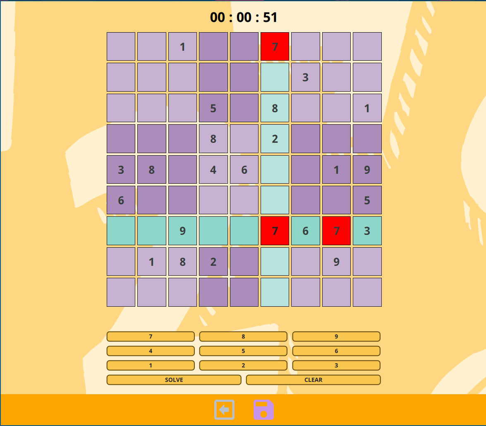

# DeepSudoku

Deep Sudoku is a cross-platform Sudoku-App that runs on desktop and mobile devices. The focus here was the Image recognition part - taking an image from an unsolved sudoku game and let a classic approach of [DSP](https://en.wikipedia.org/wiki/DSP) algorithms using OpenCV detect the individual fields
containing the numbers, and a pre-trained neural-network model solve the game.

Read the [**documentation**](https://deeedob.github.io/Deep-Sudoku/html/index.html)



## Prerequisite

Currently only tested on **Android-arm64-v8a** and Archlinux with 5.18.16-arch kernel. These dependencies are required to be installed on your system in order to build the app.

- Install [Qt >= 6.3.0 for Android](https://doc-snapshots.qt.io/qt6-dev/android-building.html)
- Install Android [SDK](https://developer.android.com/studio) and [NDK](https://developer.android.com/ndk/downloads)

### Linux only

When building for desktop consider that these tools are [required](https://doc.qt.io/qt-5/linux-requirements.html) for QtMultimedia to work properly :

```shell
# archlinux commands
  pacman -S gstreamer at-spi2-core gst-plugins-good gst-plugins-bad gst-plugins-ugly gst-libav
```

Following dependencies are required for opencv:

```shell
  pacman -S openmp
```

If there is a desire to rebuild the documentation provided in docs/html then it is required to have these tools installed:

- [doxygen](https://doxygen.nl) -- code generation tool
- [doxyqml](https://invent.kde.org/sdk/doxyqml) -- Integrate QML code generation into doxygen

## Building

Clone this repository :

```shell
    git clone --recursive https://github.com/DeepSudoku/QtSudoku.git
```

The build process can take some time as we are building opencv from source in both builds. As we are using a superbuild approach there will be no console output during the compilation. So no stress and let CMake Build OpenCV!

**ANDROID BUILD**

```shell
    cd Deep-Sudoku
    #shadow build
    mkdir android-build-<YOURABI>; cd android-build-<YOURABI>

    cmake -G <yourGenerator> \
        -DCMAKE_TOOLCHAIN_FILE=/path-to/android-sdk/ndk/<version>/build/cmake/android.toolchain.cmake \
        -DANDROID_SDK_ROOT=/path-to/android-sdk \
        -DANDROID_NDK=/path-to/ndk/<version> \
        -DANDROID_QT_ROOT=/path-to-qt-android/ \
        -DQT_HOST_PATH=/path-to-qt-host/ \
        -DANDROID_ABI=<your abi> \
        -DCMAKE_BUILD_TYPE=Release ..
```

For my build it looks as followed:

```shell
  #inside Deep-Sudoku
  mkdir android-build-aarch64; cd android-build-aarch64;
  cmake -G Ninja \
    -DCMAKE_TOOLCHAIN_FILE=/home/dennis/Android/android-sdk/ndk/23.1.7779620/build/cmake/android.toolchain.cmake \
    -DANDROID_SDK_ROOT=/home/dennis/Android/android-sdk \
    -DANDROID_NDK=/home/dennis/Android/android-sdk/ndk/23.1.7779620 \
    -DANDROID_QT_ROOT=/home/dennis/Qt6.3/6.3.1/android_arm64_v8a \
    -DQT_HOST_PATH=/home/dennis/Qt6.3/6.3.1/gcc_64 \
    -DANDROID_ABI=arm64-v8a \
    -DCMAKE_BUILD_TYPE=Release ..
```

After successfully building the app you can find a folder named “android-build" inside your build directory. To deploy the application to the mobile device you need to invoke the tool:

> [androiddeployqt](https://code.qt.io/cgit/qt/qtbase.git/tree/src/tools/androiddeployqt/main.cpp).

Which bundles all of the content to an APK file required for an android application and sends it to the device. I wrote a little script for UNIX like operating system to invoke this tool and have a executable file.
[deploy_android.sh](scripts/deploy_android.sh) The **build** directory containing **deployment-settings.json** and the path to the **androiddeployqt** tool are required as input parameters.

**DESKTOP BUILD**

```shell
    cd Deep-Sudoku
    #shadow build
    mkdir desktop-build;cd desktop-build

    cmake -G <yourGenerator> \
        -DCMAKE_BUILD_TYPE=Debug .. #or release
```

## Possible Problems

### Linux

- create a udev rule for your mobile device

 ```shell
    usb-devices # get idVendor and idProduct
    echo "SUBSYSTEM==\"usb\", ATTR{idVendor}==\"<yourIDVendor>\", ATTR{idProduct}==\"<yourIDProduct>\", MODE=\"0666\", GROUP=\"plugdev\""  | sudo tee -a /etc/udev/rules.d/51.android.rules
    # add user to plugdev group
    usermod -a -G plugdev <user>
```